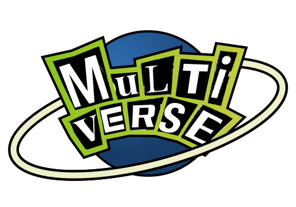

<h1 align = "center"> ✧ Multiverse ✧ </h1>

A Balatro mod where I add whatever I feel like to the game.
This mod introduces:
 - New Jokers (mostly) based on references to other things, somewhat balanced compared to vanilla Jokers
 - A new "transmutation" mechanic that transmutes Jokers into more powerful Transmuted Jokers that exceed the power of Legendary jokers
 - Enhancements, Seals and Stickers associated with these Transmuted Jokers
 - New Tarot and Spectral cards to add more variety to the overall Balatro experience
 - Myth Cards, a new consumable type to facilitate this transmutation mechanic

> :page_facing_up: Note: Compatibility with other mods is **not** guaranteed.

## Future Steps

- [ ] Get *human-made* art for everything in this mod
- [x] Ensure compatibility with Talisman
- [ ] Create transmutations for other modded Jokers

## License

This project is licensed under the GNU General Public License. This ensures that the software is free to use, modify, and distribute. For more details, read the license.
